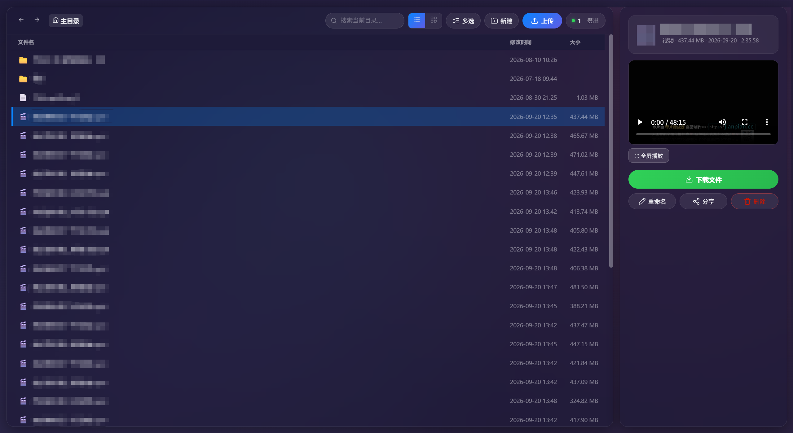

# 🌟 现代化局域网文件共享系统

基于 Python + Flask 的局域网文件共享服务器:浏览、上传、下载、在线预览、文件管理、免登录临时分享。毛玻璃 UI,支持手机,生产级 WSGI 服务器(waitress)驱动。



## ✨ 功能一览

- **文件浏览**:三栏布局(目录树 / 文件列表 / 详情面板),文件夹置顶排序,服务端分页(每页 300 项)
- **在线预览**:视频/音频(支持拖进度条,Range 请求)、图片、PDF、文本,浏览器不支持的格式自动提示下载
- **列表/网格视图**:网格视图为图片生成真缩略图(磁盘缓存),可记住偏好
- **搜索与排序**:当前目录即时过滤;按名称/时间/大小点击表头排序
- **文件上传**:多选 + 拖拽(支持整页拖入)、实时进度条(百分比 + 速度)、中文名完整保留、同名自动加 `(1)` 副本
- **多选下载**:勾选多个文件/文件夹后,可逐个直接下载,或打包为一个 zip(视频/图片等已压缩内容不做二次压缩)
- **在线预览增强**:图片/视频支持灯箱放大与全屏播放,详情面板显示类型徽章
- **深色模式**:自动跟随系统外观切换,全套界面适配
- **快捷键**:`Esc` 逐层关闭弹窗/浮层,`/` 或 `Ctrl+K` 聚焦搜索
- **图标**:[Lucide](https://lucide.dev)(MIT 许可,已本地化部署于 `static/vendor/`,离线可用)
- **文件管理**:新建文件夹、重命名、删除(删除移入 Windows 回收站,误删可恢复),全部带确认与 CSRF 保护
- **临时分享链接**:对任意文件/文件夹生成免登录链接(1 小时 / 24 小时 / 7 天),带二维码,到期自动失效;文件夹分享支持在其子树内浏览下载
- **账号体系**:管理员(全部权限)+ 访客 guest(只读);密码以 PBKDF2/scrypt 哈希存储
- **安全**:登录认证、路径穿越防护、CSRF token、上传大小上限
- **运维**:waitress 多线程服务、滚动日志(app.log)、启动时打印局域网访问地址并自动打开浏览器

## 📦 项目结构

```
├── config.py            # ⚙️ 全部配置(端口/共享目录/账号/上传上限/分享有效期)
├── app.py               # 🚀 Flask 主程序(路由与业务逻辑)
├── static/
│   ├── style.css        # 🎨 毛玻璃 UI 样式
│   └── app.js           # 🖱️ 前端交互逻辑
├── templates/
│   ├── index.html       # 🏛️ 主界面
│   ├── login.html       # 🔐 登录页
│   ├── share.html       # 🔗 免登录分享落地页
│   └── error.html       # ⚠️ 友好错误页(400/404)
├── tests/               # 🧪 pytest 测试集(pytest tests/)
├── requirements.txt     # 📋 依赖(版本按当前环境固定)
├── .secret_key          # 🔑 首次启动自动生成的会话密钥
├── share_links.json     # 🔗 分享链接持久化(运行期生成)
├── thumb_cache/         # 🖼️ 缩略图缓存(运行期生成)
└── app.log              # 📜 滚动日志(运行期生成)
```

## 🛠️ 安装与启动

1.  **安装依赖**
    ```bash
    pip install -r requirements.txt
    ```
2.  **启动**
    ```bash
    python app.py
    ```
    控制台会列出所有局域网访问地址(如 `http://192.168.x.x:5000`)并自动打开浏览器;同局域网设备直接访问该地址。

## 🌐 跨网络访问(Tailscale)

应用默认只在同一局域网内可访问。校园网跨网段隔离、手机用流量或热点时无法直连,使用 [Tailscale](https://tailscale.com) 组网即可解决——PC 和手机装上客户端后,无论网络怎么换都能互访。

**步骤:**

1.  PC 上安装 [Tailscale 客户端](https://tailscale.com/download) 并登录账号
2.  手机安装 Tailscale App(iOS/Android),登录**同一账号**
3.  重启本应用,启动横幅会自动多出一行带 `Tailscale` 标注的地址(形如 `http://100.x.x.x:5000`)
4.  手机浏览器访问该地址即可,二维码分享/分享链接同样自动可用

**说明:**

-   免费个人计划额度对个人绰绰有余(约 100 台设备/3 用户)
-   Tailscale **客户端开源**(BSD-3 许可),官方协调服务器为闭源 SaaS;要求全开源可自建 [Headscale](https://github.com/juanfont/headscale)(需一台有公网 IP 的 VPS)
-   个别封锁 UDP 的网络下会自动走 DERP 中继(TCP 443),能通但速度略降
-   虚拟网络内只有你账号下的设备能访问,应用本身的登录认证继续生效

## 👤 账号

| 账号 | 密码 | 权限 |
|------|------|------|
| `1` | `1` | 管理员:上传/管理/分享 |
| `guest` | `guest` | 访客:浏览/下载/预览(只读) |

修改密码:生成新哈希并替换 [config.py](config.py) 中对应条目

```bash
python -c "from werkzeug.security import generate_password_hash; print(generate_password_hash('新密码'))"
```

## ⚙️ 常用配置(config.py)

| 配置 | 默认值 | 说明 |
|------|--------|------|
| `SHARED_DIR` | `D:/共享` | 共享根目录 |
| `PORT` | `5000` | 服务端口 |
| `MAX_CONTENT_LENGTH` | 10 GB | 单次上传上限 |
| `PAGE_SIZE` | 300 | 文件列表每页条数 |
| `SHARE_HOURS_OPTIONS` | 1/24/168 | 分享链接有效期选项(小时) |
| `THUMB_SIZE` | 256 | 缩略图最长边 |

## 💡 使用要点

- **上传**:点"上传文件"或把文件直接拖到页面任意位置;进度条走完后页面自动刷新
- **预览**:点文件后右侧面板直接播放视频/音频、显示图片/PDF/文本
- **管理**:点文件/文件夹后在右侧面板"重命名 / 删除 / 分享";顶部"📁+ 新建"建文件夹
- **多选下载**:点"☑ 多选"进入选择模式,勾选后用底部操作栏"📥 直接下载"(逐个原文件)或"📦 打包下载"(单个 zip);"全选"只作用于当前可见(搜索过滤后)的条目
- **分享**:面板中点"🔗 分享",选有效期生成免登录链接,可复制或扫码;删除文件进回收站
- **手机**:点文件后详情全屏弹出,可直接下载;访问分享链接无需登录
- **测试**:`pytest tests/ -v`(25 个用例覆盖上传/权限/分享/穿越防护等)

## 🔧 故障排除

- **无法访问**:确认防火墙放行端口;以启动控制台打印的局域网地址为准
- **上传失败**:确认账号是管理员、目标目录存在、未超过 10GB 上限
- **视频无法播放**:个别编码(如部分 mkv/avi)浏览器不支持,详情面板会提示下载观看
- **样式/行为异常**:浏览器强刷(Ctrl+F5)排除静态缓存

## 📄 开源协议

MIT
